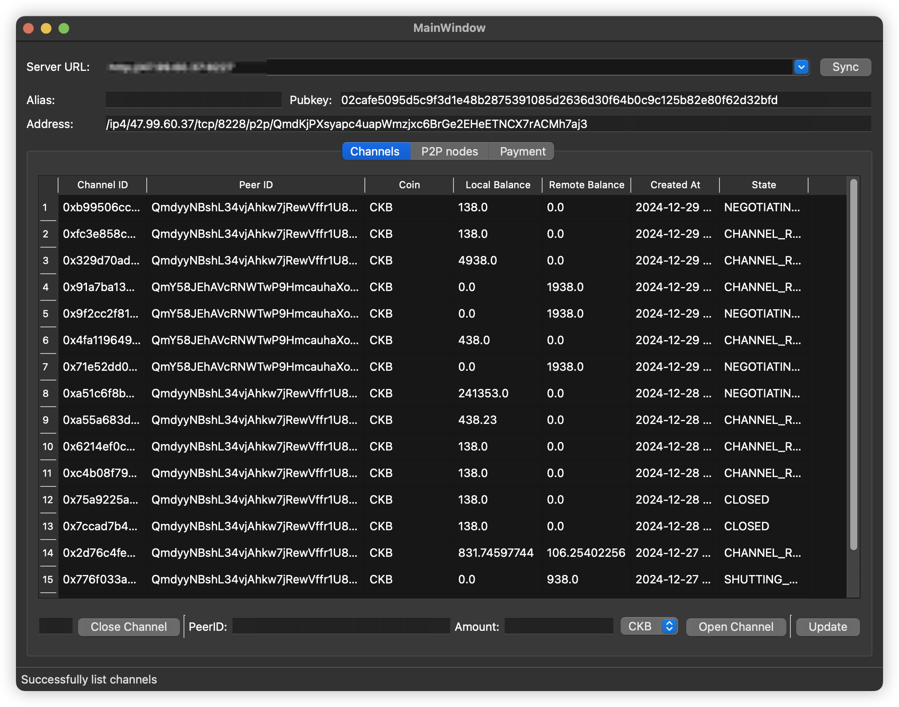
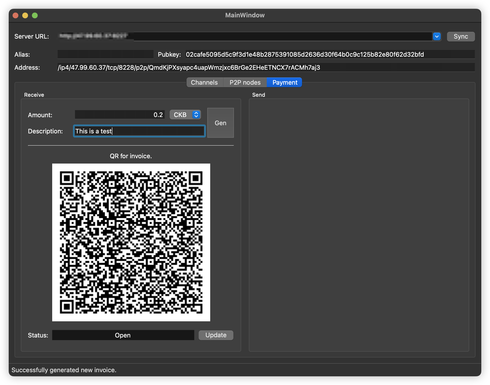

# Simple GUI for Fiber CLI





How to use:

1. install requirements:

```
$ pip3 install -r requirements.txt
```

2. run

```
$ python3 main.py
```

3. build 

```
$ pyinstaller main.spec
```

Or, you can download the binary in the release page.